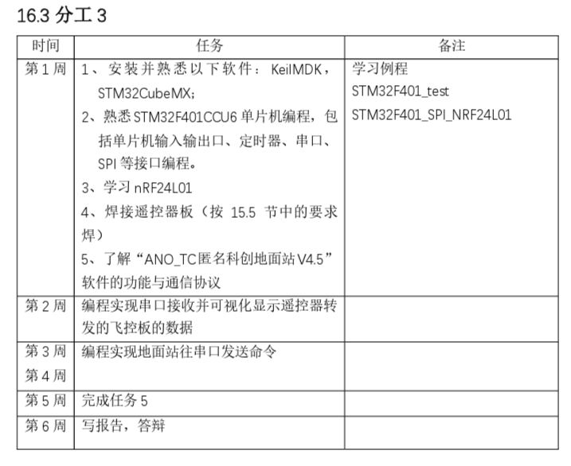

# GDUT-Information-Engineering-2024-UAV-Ground-Station

本项目是 gdut 信息工程学院大三下的前六周的课程设计的分工 3——实现一个无人机地面站

## 要求


[text](无人机.docx)

## 使用方法

- 本项目分成客户端和服务端，通过 WebSocket 进行通信。
- 客户端使用 vue2+element-ui，以及分别使用 three.js 和 export-to-csv 和 echart 模块实现各个页面的功能.
- 服务端使用 serialport 模块与无人机遥控器进行串口通信，根据协议解析数据，将解析结果处理后通过 WebSocket 发送给客户端

### client

#### Project setup

```
yarn install
```

#### Compiles and hot-reloads for development

```
yarn serve
```

#### Compiles and minifies for production

```
yarn build
```

#### Lints and fixes files

```
yarn lint
```

#### Customize configuration

See [Configuration Reference](https://cli.vuejs.org/config/).

### server

#### 依赖安装

```
npm install
```

#### 启动后台

```
node index
```

或者

```
npm run dev
```

#### 开发过程用到的模块

`serialport`、 `nodemon`、`ws`

#### nodemon

```
"scripts": {
    "dev": "nodemon index.js" //在package.json里添加这句
  },
```

#### node 版本

`v20.12.1`
